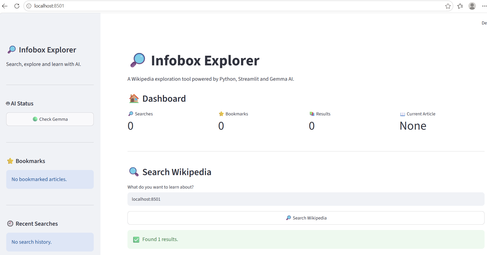

# Infobox Explorer

## 📌 Project Overview

Infobox Explorer is an interactive web application that helps users search and explore information from Wikipedia in a simple and user-friendly interface.

The application uses Python, Streamlit, Wikipedia, and a local Gemma 2B AI model through Ollama to provide summaries, key points, explanations, related articles, statistics, and voice-based interaction.

## ✨ Features

- 🔎 Search Wikipedia articles
- 📖 View article summaries and content
- 🖼️ Display available article images
- 📋 Extract Wikipedia infobox information
- 🤖 AI-powered summaries using Gemma 2B
- 💡 Explain information in simple language
- 💬 Chat with the local AI assistant
- 🎤 Voice input
- 🔊 Read AI answers aloud
- 🔗 Explore related Wikipedia articles
- 📊 View article statistics
- 🔖 Bookmark articles
- 🕘 View recent searches
- 📥 Download article content

## 🛠️ Technologies Used

- Python
- Streamlit
- Wikipedia
- BeautifulSoup
- Requests
- Gemma 2B
- Ollama
- gTTS
- Streamlit Mic Recorder

## 🤖 AI Model

The project uses **Gemma 2B** as a local AI model through **Ollama**.

The AI features include:

- Article summarization
- Key point generation
- Simple explanations
- Question answering
- Voice-based interaction

## 📂 Project Structure

```text
infobox-explorer/
│
├── app.py
├── README.md
└── requirements.txt
## 📸 Application Screenshot

